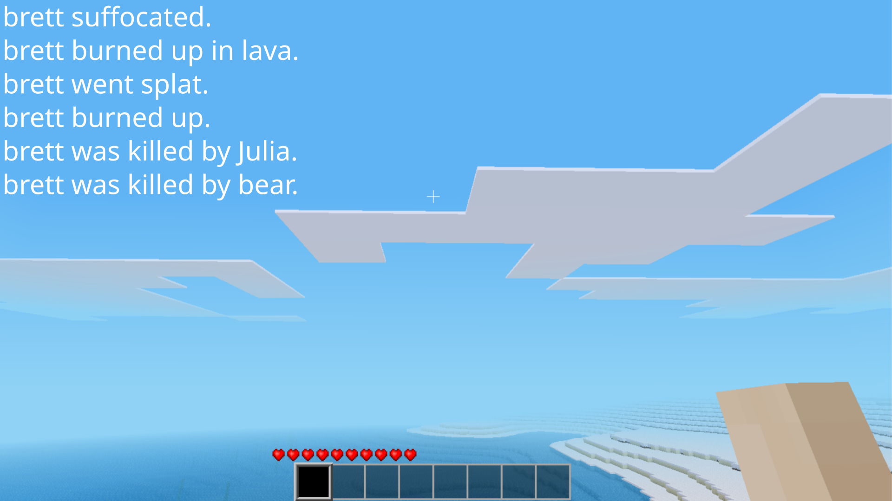

# Glamorous Deaths

A Minetest mod to give your deaths some pizzazz with messages. A fork of
EvergreenTree's [death_messages](https://github.com/4Evergreen4/death_messages)
with fixes and improvements. That mod heroically attempted death reasons
through guesswork since the Minetest API didn't give death reasons. Now we can
do better!

This mod announces a player's death server-wide. You might recall such behavior
from a certain popular mining game or an old-school shooter. The messages are
randomized… Unless you don't want that; One can configure the mod to only use
the finest message available for each particular death.

_Glamorous Deaths_ uses the internal Minetest API to determine which message to
use. For instance, falling in lava will generate different messages than
drowning. Additionally, if the player is killed by another player or entity
(such as a mob) then it will display the name in a human-friendly way.

## License

GPLv3 (see [LICENSE](LICENSE))

## Installation

There are no dependencies, so merely install via the Minetest content manager
or [download from ContentDB](https://content.minetest.net/packages/mixer/glamorous_deaths/) and
[follow the official instructions to install mods](https://wiki.minetest.net/Installing_Mods).

## Submitting issues

The project is hosted on [sh.rt](https://git.sr.ht/~ainola/minetest-glamorous-deaths/). Report issues on the accompanying [issue tracker](https://todo.sr.ht/~ainola/minetest-glamorous-deaths).
